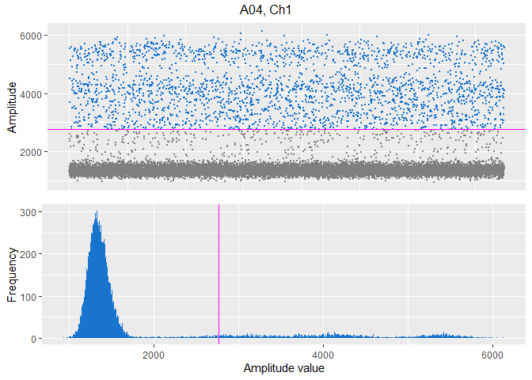
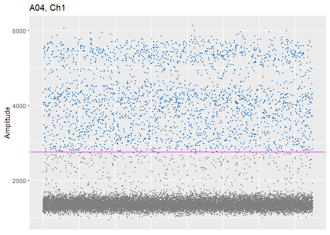
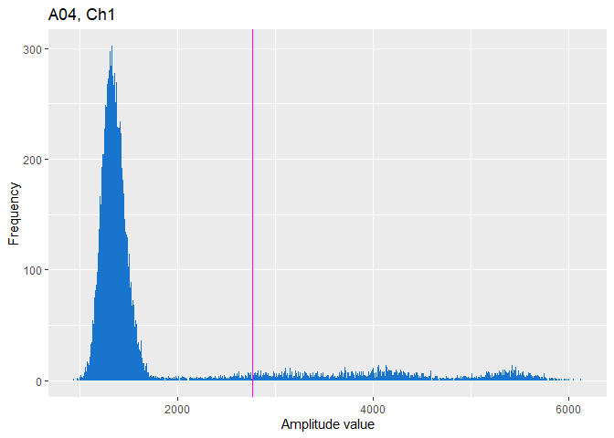
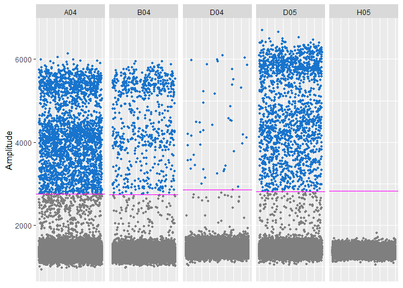

<!-- README.md is generated from README.Rmd. Please edit that file -->

# PoDCall

<!-- badges: start -->

<!-- badges: end -->

# Introduction

PoDCall (Positive Droplet Caller) is a package that aims to provide a
robust calling of positive droplets in DNA methylation droplet digital
PCR (ddPCR) experiments performed on the Bio-Rad platform. PoDCall
provides functions that reads files exported from QuantaSoft containing
amplitudes from a run of ddPCR (one 96 well plate), sets thresholds for
both channels of each individual well and calculates concentrations and
normalized concentration for each well. The resulting threshold table
can optionally be written to file automatically by the main workflow
function. PoDCall also offers functionality for plotting, both
individual wells and multiple well plots. Plots for individual wells can
be made and saved as .pdf-files as part of the main workflow function
`podcallDdpcr()`, or by calling the various plotting functions
individually.

## Gaussian Mixture Models

DdPCR experiments generate a mixture of droplets, positive droplets
which contain the target that will be amplified, and negative droplets
that does not contain the target and show no amplification. PoDCall
relies on fitting Gaussian mixture models to set thresholds for each
individual well that will be used to classify the droplets as either
positive or negative. For more details on the concepts of PoDCall, see
the application note.

## Input Data

The input data is .csv-files exported from ‘QuantaSoft’, and each file
contains the amplitude values of droplets from one well of a 96 well
plate. The first two columns of the files should have headers ‘Ch1
Amplitude’ and ‘Ch2 Amplitude’. To read in data, use the function
importAmplitudeData, which will read all amplitude files in the
directory given as argument. Each file will be stored as a named data
frame in a list, where the name will be the well ID. For this reason,
all raw data files in the directory given as argument should be from the
same 96 well plate to avoid well coordinate duplicates.

# Installation

PoDCall requires some packages to be installed, and if any required
packages are not yet installed, the installation of PoDCall should take
care of it (you will be prompted to install the packages that are
missing).

The released version of PoDCall can be installed from
[BIOCONDUCTOR](http://bioconductor.org/) using

``` r
## Install PoDCall from Bioconductor
if (!requireNamespace("BiocManager", quietly = TRUE))
    install.packages("BiocManager")

BiocManager::install("PoDCall")

## Install PoDCall from GitHub
install.packages("devtools")
devtools::install_github("HansPetterBrodal/PoDCall")

## Install PoDCall from source file
install.packages("remotes")
remotes::install_local("path/to/PoDCall_x.y.z.tar.gz")
```

After installing PoDCall and the required packages, PoDCall can be
loaded with:

``` r

library(PoDCall)
```

# Example / Usage

One step of setting thresholds includes a random sampling of droplets to
greatly reduce running time. To ensure reproducible results it is
recommended to set a seed using `set.seed()`. To run the full PoDCall
workflow, call the function `podcallDdpcr()`:

``` r
## Run PoDCall
thresholdTable <- podcallDdpcr(dataDirectory="path/to/data/")
```

Where “path/to/data/” is the path of the directory that contains
amplitude files from a well plate, in which the files have names that
end with "\_wellID\_amplitude.csv".

## Optional arguments

The following arguments have default values, but can be given other
values if desired. For example to write results to file, which is
disabled by default.

### sampleSheetFile

Path to sample sheet file. Must be a .csv file exported from QuantaSoft
and must include the following columns: Well, Sample, TargetType and
Target. The entries in the column TargetType must be either ‘Ch1Unknown’
or ‘Ch2Unknown’, and is used to extract rows with information from
either channel 1 or channel 2. An example file has been included in the
package, which can be found using `system.file("extdata",
"Sample_names.csv", package="PoDCall")`

### B

The number of permutations used by the likelihood ratio test (LRT) which
decides the number of components in the model fitted from the data.
Default value `B=200`.

### Q

A parameter used for calling outliers. Q is multiplied with the
interquartile range of the distribution of amplitude values to determine
if droplets of extreme amplitude values are to be considered outliers.
The default value is `Q=9`, which has been determined through cell line
experiments and testing. A higher Q will generally result in a higher or
more strict threshold. Q provides an option to adjust how thresholds are
set in a systematic and reproducible way. It is recommended to try a few
different values and visually inspect the results.

### refwell

The well used as reference when calculating the shift in baseline
between wells. By default `refwell=1`, but can be changed in cases where
the first well is not suited to be used.

### ch2

If channel 2 is not in use, set ch2 = FALSE to avoid error caused by
empty channel 2 column. Default is `ch2=TRUE`.

### resultsToFile

The user can choose to let PoDCall save the results table as a .csv-file
by setting `resultsToFile=TRUE` (default: `resultsToFile = FALSE`). When
resultsToFile is set to TRUE, a results directory will be created where
the result file will be saved. The results directory will have the same
name as the data directory with "\_results" added:
"path/to/data\_results/

### plots

The user can choose to make plots that are written to file by setting
`plots=TRUE` (default: `plots=FALSE`). Plots will be saved to the
results directory created when `resultsToFile=TRUE`. The results
directory will also be created if only `plots=TRUE`.

### resPath

Optional argument to specify a directory for writing results file(s) to
other than the results directory created by default. Requires
`resultsToFile=TRUE`.

## Threshold table columns

The table that is returned when running `podcallDdpcr()` contains
columns with more or less self-explanatory column names, and well ID
(well coordinates) as rownames:

### sample\_id

If a sample sheet file is provided, this will have the sample ID from
the sample sheet. Otherwise empty

### thr\_target

the threshold set for channel 1, assumed to be the target

### thr\_ctrl

The threshold set for channel 2, assumed to be the control

### pos\_dr\_target

The number of positive droplets in channel 1 (target)

### pos\_dr\_ctrl

The number of positive droplets in channel 2 (control)

### tot\_droplets

Number of droplets.

### c\_target

Concentration of target, calculated by the formula
\(-\ln\dfrac{\dfrac{\text{neg_drop_tar}}{\text{tot_droplets}}}{0.000851}\)
(where does 0.000851 come from from and what is the name of this
parameter) where neg\_drop\_tar is number of negative droplets in
channel 1 (target).

### c\_ctrl

Concentration of control, calculated by the formula
\(-\ln\dfrac{\dfrac{\text{neg_drop_ctrl}}{\text{tot_droplets}}}{0.000851}\)
where neg\_drop\_ctrl is number of negative droplets in channel 2
(control).

### c\_norm\_4Plex

Normalized concentration with 4Plex as control, calculated by the
formula \(\dfrac{\text{c_target}}{\text{c_ctrl}}\cdot400\)

### c\_norm\_sg

Normalized concentration with single gene as control, calculated by the
formula \(\dfrac{\text{c_target}}{\text{c_ctrl}}\cdot100\)

# PoDCall functions

`podcallDdpcr()` is the main wrapper function that returns a table with
the results of PoDCall to the user. This function uses a set of
functions that read the amplitude data from file, set thresholds and
make plots. All functions involved can be used individually should the
user only want to use some of the functionality of PoDCall. Also see
help files for more details about the functions and their arguments.

## `importAmplitudeData()`

Reads .csv-files with amplitude data outputted from QuantaSoft and store
the data in a list, one data frame per well. Each element in the list
will be named using it’s well ID (coordinate) of the 96 well plate that
the sample belong to.

``` r
## Path to example data files included in PoDCall
path <- system.file("extdata", "Amplitudes/", package="PoDCall")

## Read in data files
dataList <- importAmplitudeData(dataDirectory=path)
str(dataList)
#> List of 5
#>  $ A04:'data.frame': 18739 obs. of  2 variables:
#>   ..$ Ch1: num [1:18739] 940 971 971 976 985 ...
#>   ..$ Ch2: num [1:18739] 11795 7868 8377 10007 9523 ...
#>  $ B04:'data.frame': 16933 obs. of  2 variables:
#>   ..$ Ch1: num [1:16933] 980 995 1002 1007 1014 ...
#>   ..$ Ch2: num [1:16933] 9524 7999 7686 7799 9510 ...
#>  $ D04:'data.frame': 11713 obs. of  2 variables:
#>   ..$ Ch1: num [1:11713] 1042 1070 1094 1112 1112 ...
#>   ..$ Ch2: num [1:11713] 7826 9934 7698 7605 7743 ...
#>  $ D05:'data.frame': 12642 obs. of  2 variables:
#>   ..$ Ch1: num [1:12642] 1045 1057 1063 1068 1079 ...
#>   ..$ Ch2: num [1:12642] 9722 7752 9103 7716 7738 ...
#>  $ H05:'data.frame': 19638 obs. of  2 variables:
#>   ..$ Ch1: num [1:19638] 1043 1094 1098 1104 1119 ...
#>   ..$ Ch2: num [1:19638] 7231 7063 7161 6863 7416 ...
```

## `importSampleSheet()`

Reads a .csv-file outputted from QuantaSoft to get information about the
samples: Sample name/id, Assay for target and control.

``` r
## Path to example files included in PoDCall
path <- system.file("extdata", "Sample_names.csv", package="PoDCall")

## Select wells to get information for
well_id <- c("A04", "B04", "D04")

## Read in sample sheet information for selected wells
sampleSheet <- importSampleSheet(sampleSheet=path, well_id=well_id)
print(sampleSheet)
#>   well_id sample_id target_assay ctrl_assay
#> 1     A04    SW1463          VIM   new4Plex
#> 2     B04     SW403          VIM   new4Plex
#> 3     D04     SW480          VIM   new4Plex
```

## `podcallThresholds()`

Takes a list of data frames, one for each well, as argument and sets
individual thresholds for each channel of each well. It returns a table
with thresholds, number of positive droplets, concentrations etc. The
number of permutations for likelihood ratio test is by default set to
`B=400` as a compromise between run time and stability of the results.
The parameter for calling outliers is by default set to `Q=9`. Higher Q
means more conservative (higher) thresholds, lower Q will result in over
all lower thresholds.

``` r
## Path to example data files included in PoDCall
path <- system.file("extdata", "Amplitudes/", package="PoDCall")

## Read in data files
ampData <- importAmplitudeData(dataDirectory=path)

## Calculate thresholds, metrics, concentrations
thresholdTable <- podcallThresholds(plateData=ampData)
print(thresholdTable)
```

## `podcallChannelPlot()`

Takes the threshold and amplitude values corresponding to a channel of a
well as arguments, calls functions that makes scatter plot and histogram
and draws a plot with both.

``` r
## Read in data and threshold table
path <- system.file("extdata", "Amplitudes/", package="PoDCall")
ampData <- importAmplitudeData(dataDirectory=path)
data("thrTable")
thresholdTable <- thrTable

## Select channel and well to plot
ch <- 1 # target channel
well_id <- names(ampData)[1] # First well in list

## Plot title
plotTitle <- paste0(well_id, ", Ch", ch)

## Create plot
podcallChannelPlot(channelData=ampData[[well_id]][,ch],
                    thr=thresholdTable[well_id, "thr_target"],
                    channel=ch,
                    plotId=plotTitle)
```



## `podcallScatterplot()`

Takes the threshold and amplitude values corresponding to a channel of a
well as argument and returns a scatter plot.

``` r
## Read in data and threshold table
path <- system.file("extdata", "Amplitudes/", package="PoDCall")
ampData <- importAmplitudeData(dataDirectory=path)
thresholdTable <- thrTable

## Select channel and well to plot
ch <- 1 # target channel
well_id <- names(ampData)[1] # First well in list

## Plot title
plotTitle <- paste0(well_id, ", Ch", ch)

## Create plot
podcallScatterplot(channelData=ampData[[well_id]][,ch],
                    thr=thresholdTable[well_id, "thr_target"],
                    channel=ch,
                    plotId=plotTitle)
```



## `podcallHistogram()`

Takes the threshold and amplitude values corresponding to a channel of a
well as argument, and returns a histogram.

``` r
## Read in data and threshold table
path <- system.file("extdata", "Amplitudes/", package="PoDCall")
ampData <- importAmplitudeData(dataDirectory=path)
thresholdTable <- thrTable

## Select channel and well to plot
ch <- 1 # target channel
well_id <- names(ampData)[1] # First well in list

## Plot title
plotTitle <- paste0(well_id, ", Ch", ch)

## Create plot
podcallHistogram(channelData=ampData[[well_id]][,ch],
                thr=thresholdTable[well_id, "thr_target"],
                channel=ch,
                plotId=plotTitle)
```



## `podcallMultiplot()`

takes a list of data frames with amplitude data, one per well, and their
respective thresholds as arguments and returns faceted scatter plots
suitable for comparing wells.

``` r
## Read in data and threshold table
path <- system.file("extdata", "Amplitudes/", package="PoDCall")
ampData <- importAmplitudeData(dataDirectory=path)
thresholdTable <- thrTable

## Channel to plot
ch <- 1

## Create comparison plot
podcallMultiplot(plateData=ampData,
                thresholds=thresholdTable[names(ampData),], 
                channel=ch)
```



# PoDCall shiny application

PoDCall does also include an application powered by shiny that launches
in a web browser. The application provides a user friendly and
interactive interface to the functionality of PoDCall. To start the app:

``` r
podcallShiny()
```

# PodCall example data

There are some amplitude files and a sample sheet included in the
package that are intended to be used to run examples and to try out the
functionality of PoDCall. The data files are from a real experiment
performed with cell line samples. There is also a threshold table
computed from the example data included. PoDCall takes a few minutes to
run due to bootstrapping, and this table is used in examples for
functions where threshold is an argument.

## Cell Line Amplitude Data

The cell line amplitude data files can be found in the “extdata”
subdirectory of the package directory and can be found using
`system.file()`:

``` r
## Path to files
path <- system.file("extdata", "Amplitudes/", package="PoDCall")

## List files
list.files(path)
#> [1] "VIM_4Plex_A04_Amplitude.csv" "VIM_4Plex_B04_Amplitude.csv"
#> [3] "VIM_4Plex_D04_Amplitude.csv" "VIM_4Plex_D05_Amplitude.csv"
#> [5] "VIM_4Plex_H05_Amplitude.csv"
```

The control assay used for the samples in the example data files is an
assay developed in-house called 4Plex [H. Pharo et
al](http://dx.doi.org/10.1186/s13148-018-0456-5).

## Calculated Threshold Table

The already calculated threshold table is instantly available when
PoDCall is loaded, and is available as an object called `thrTable`. See
`?thrTable` for help file with documentation on the table.

``` r
## The threshold table
thrTable
#>       sample_id thr_target thr_ctrl pos_dr_target pos_dr_ctrl tot_droplets
#> A04      SW1463       2761     8750          2479       13190        18739
#> B04       SW403       2739     8254           660        7789        16933
#> D04       SW480       2863     8111            44        8509        11713
#> D05 IVDZ_bisulf       2818     8095          1675        6823        12642
#> H05         NTC       2823     7532             0          91        19638
#>     c_target   c_ctrl c_norm_4Plex c_norm_sg q target_assay ctrl_assay
#> A04  166.700 1430.000       46.630   11.6600 9          VIM   new4Plex
#> B04   46.720  724.000       25.810    6.4530 9          VIM   new4Plex
#> D04    4.423 1523.000        1.162    0.2904 9          VIM   new4Plex
#> D05  167.000  911.700       73.270   18.3200 9          VIM   new4Plex
#> H05    0.000    5.458        0.000    0.0000 9          VIM   new4Plex
```

# Session info

Here is the output of `sessionInfo()` on the system on which this
document was compiled

``` r
sessionInfo()
#> R version 4.1.0 (2021-05-18)
#> Platform: x86_64-w64-mingw32/x64 (64-bit)
#> Running under: Windows 7 x64 (build 7601) Service Pack 1
#> 
#> Matrix products: default
#> 
#> locale:
#> [1] LC_COLLATE=Norwegian (Bokmål)_Norway.1252 
#> [2] LC_CTYPE=Norwegian (Bokmål)_Norway.1252   
#> [3] LC_MONETARY=Norwegian (Bokmål)_Norway.1252
#> [4] LC_NUMERIC=C                              
#> [5] LC_TIME=Norwegian (Bokmål)_Norway.1252    
#> 
#> attached base packages:
#> [1] stats     graphics  grDevices utils     datasets  methods   base     
#> 
#> other attached packages:
#> [1] PoDCall_1.1.3
#> 
#> loaded via a namespace (and not attached):
#>  [1] Rcpp_1.0.5           highr_0.9            later_1.1.0.1       
#>  [4] compiler_4.1.0       pillar_1.6.1         shinyjs_2.0.0       
#>  [7] tools_4.1.0          digest_0.6.27        mclust_5.4.7        
#> [10] evaluate_0.14        lifecycle_1.0.0      tibble_3.0.4        
#> [13] gtable_0.3.0         pkgconfig_2.0.3      rlang_0.4.11        
#> [16] rstudioapi_0.13      cli_2.5.0            shiny_1.6.0         
#> [19] yaml_2.2.1           parallel_4.1.0       LaplacesDemon_16.1.4
#> [22] xfun_0.23            fastmap_1.0.1        gridExtra_2.3       
#> [25] stringr_1.4.0        knitr_1.33           htmlwidgets_1.5.3   
#> [28] vctrs_0.3.8          hms_1.1.0            diptest_0.75-7      
#> [31] grid_4.1.0           DT_0.18              data.table_1.13.4   
#> [34] glue_1.4.2           R6_2.5.0             fansi_0.5.0         
#> [37] rmarkdown_2.8        farver_2.1.0         ggplot2_3.3.3       
#> [40] purrr_0.3.4          readr_1.4.0          magrittr_2.0.1      
#> [43] promises_1.1.1       scales_1.1.1         htmltools_0.5.1.1   
#> [46] ellipsis_0.3.2       rlist_0.4.6.1        xtable_1.8-4        
#> [49] mime_0.9             colorspace_2.0-0     httpuv_1.5.4        
#> [52] labeling_0.4.2       utf8_1.2.1           stringi_1.6.1       
#> [55] munsell_0.5.0        crayon_1.4.1
```
